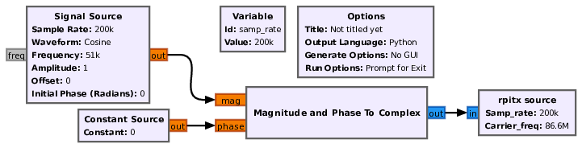
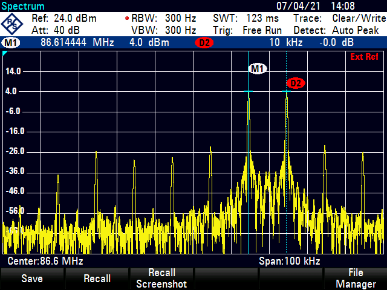
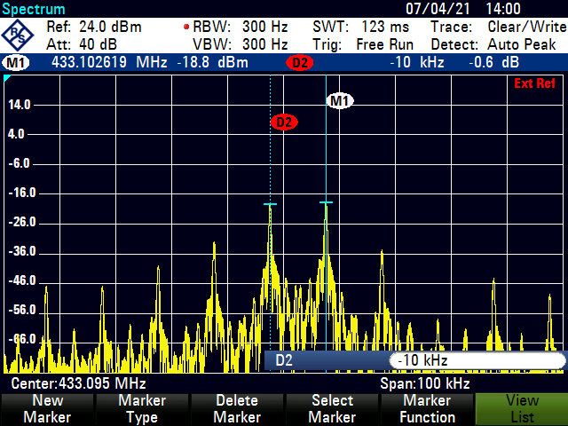
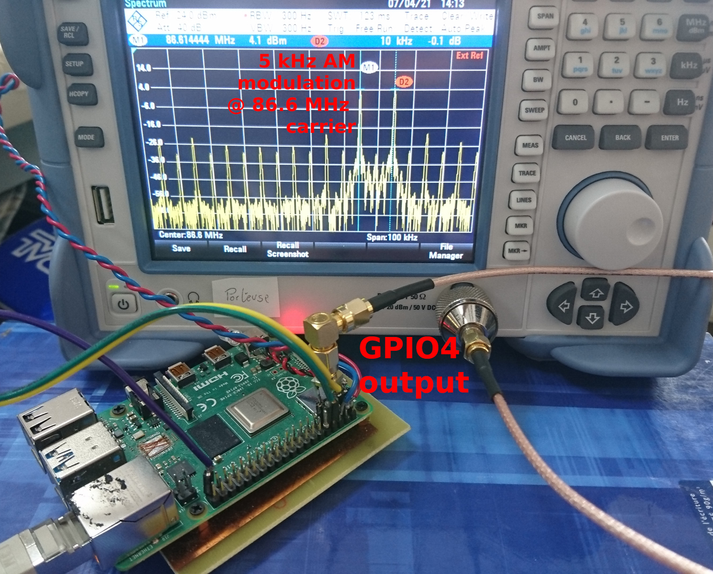

# gr-rpitx 

Using the Raspberry Pi PLL as radiofrequency source controlled from GNU Radio.

# Compiling for the Raspberry Pi target

Easiest: gr-rpitx is available for GNU Radio 3.8 as a Buildroot BR2_EXTERNAL package at 
https://github.com/oscimp/oscimp_br2_external and can be selected from 
the ``External options``. For GNU Radio 3.9, switch from ``main`` to ``gr39`` branch 
and compile manually as described below, assuming librpitx has been compiled with Buildroot.

We assume ``librpitx`` to have been compiled and installed, most probably on
the cross-compilation framework Buildroot as described at https://github.com/oscimp/oscimp_br2_external 
(tested with Buildroot 2020.11.1 and above). The benefits of using Buildroot for compiling GNU
Radio to the Raspberry Pi single board computers are detailed at
https://fosdem.org/2021/schedule/event/fsr_gnu_radio_on_embedded_using_buildroot/

See ``examples/README`` on the ``cmake`` command to run in the ``build_RP`` directory
for compiling and linking gr-rpitx with Buildroot supporting GNU Radio (configuration
files for RPi3 and RPi4 are for example found in the ``configs`` directory
of https://github.com/oscimp/oscimp_br2_external). 

To summarize the content of ``examples/README``, assuming Buildoot is installed in
``$BUILDROOT`` and the Raspberry Pi IP address is ``$IP_RPI``:

```bash
mkdir -p gr-rpitx/build_BR
cd gr-rpitx/build_BR
mkdir /tmp/tmpdir     # empty directory where compilation output will be stored
cmake -DCMAKE_INSTALL_PREFIX:PATH=/tmp/tmpdir -DCMAKE_TOOLCHAIN_FILE=$BUILDROOT/output/host/usr/share/buildroot/toolchainfile.cmake  -DCMAKE_VERBOSE_MAKEFILE:BOOL=ON ../
make
make install
scp -r /tmp/tmpdir/* root@$IP_RPI:/usr
```
will install gr-rpitx to the Raspberry Pi. Do *not* run this command in a PyBOMBS which will
override the CMAKE_INSTALL_PREFIX settings and always install the resulting binary in the 
PyBOMBS directory (which does not make sense since PyBOMBS is for the host architecture whereas 
Buildroot is compiling for the target).

# Compiling gr-rpitx on the host PC for GNU Radio Companion

*Prerequisites:* as with most cmake projects, ``doxygen``, but here additionnally make sure to have ``liborc`` development files (at the time of writing, ``liborc-0.4-dev``)

For GNU Radio Companion on the host PC to be aware of the ``gr-rpitx`` sink block,
this tool must also be compiled for the host after installing ``librpitx`` on the host 
```
git clone https://github.com/F5OEO/librpitx/
cd librpitx/src
LDFLAGS="-lm -lrt -lpthread" make
sudo make install
sudo cp librpitx.so /usr/local/lib
```

with the ``LDFLAGS=... make`` used to remove the linking step on the Raspberry Pi binary library when compiling on the host PC. Once ``librpitx`` is successfully installed on the host, we can compile ``gr-rpitx`` with

```bash
mkdir -p gr-rpitx/build_PC
cd gr-rpitx/build_PC
cmake -DCMAKE_INSTALL_PREFIX:PATH=/usr -DCMAKE_VERBOSE_MAKEFILE:BOOL=ON ../
make 
sudo make install
```

meaning that for the host PC to know about gr-rpitx source when generating the flowgraph, 
the header files must be copied to an accessible directory (most commonly ``/usr/include``) and 
the dynamic library also found on the host system (even though gr-rpitx can of course not be 
executed on the PC). To avoid transfering a new SD card image to the RPi, we have selected to 
install the ARM binaries in a temporary directory on the host, e.g. ``/tmp/tempdir`` thanks to 
``make install`` after completing ``make`` and then ``scp -r /tmp/tempdir $IP_RPI:/usr`` since 
the tree structure in the installation directory matches the target tree structure starting 
from ``/usr``. When using a GNU Radio installation generated with PyBOMBS, remove the ``-DCMAKE_INSTALL_PREFIX`` option when installing to the host since PyBOMS knows where to install the binaries it needs to access.

# Usage (on the target Raspberry Pi)

SampleRate 10000-250000 (as given by the author of librpitx)

Complex float input I,Q samples

Carrier frequency [Hz] in the 50 kHz to 1500 MHz range, dynamically tunable as 
demonstrated at http://jmfriedt.free.fr/gr-rpitx_set_freq.mp4

Application example: AM modulated signal using the following flowchart, generated from GNU Radio
Companion on the host PC and executed with No GUI on the target Raspberry Pi 4:



resulting in the following measurements at fundamental frequency (left) and overtone 5:




Experimental setup: NEVER EVER radiate the RPiTX output on an antenna, only measure using a wired
connection to the receiver:



Movie demonstrating the use of gr-rpitx for emitting an FM signal received by
a DVB-T dongle: https://github.com/jmfriedt/gr-rpitx/tree/main/examples/gr-rpitx_demo.mp4


# Troubleshooting

What if gr-rpitx does not work ?

1. launch python3 on the Raspberry Pi and ``import rpitx`` should not return any error. If it does, the error might be more useful than the simple ``AttributeError: module 'rpitx' has no attribute 'rpitx_source'`` provided by GNU Radio which does not tell us anything about the cause of the error. 
Most usually the error is due to /usr/lib/librpitx.so missing on the embedded board, as indicated when importing rpitx in Python3 leading to the error 
message ``librpitx.so: cannot open shared object file: No such file or directory``
2. make sure GNU Radio is properly installed on the Raspberry Pi, as validated by running Python3 on the embedded board and ``import gnuradio`` should 
not return any error message.
3. make sure *no* file named ``rpitx.py`` or ``rpitx.pyc`` is in the current directory (as would be the case if the project Id in gnuradio-companion is ``rpitx``)
