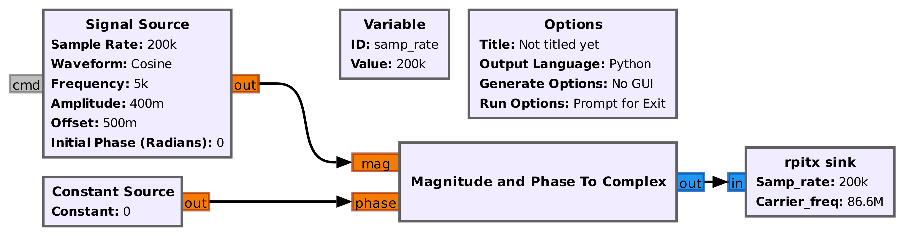

# gr-rpitx 

Using the Raspberry Pi PLL as radiofrequency source controlled from GNU Radio.

# Compiling

We assumed ``librpitx`` to have been compiled and installed, most probably on
the cross-compilation framework Buildroot as described at 

See ``examples/README`` on the ``cmake`` command to run in the ``build_RP`` directory
for compiling and linking gr-rpitx with Buildroot supporting GNU Radio (configuration
files for RPi3 and RPi4 are for example found in the ``configs`` directory
of https://github.com/oscimp/PlutoSDR). For the host PC to know about gr-rpitx source 
when generating the flowgraph, the header files must be copied to an accessible directory 
(most commonly ``/usr/include``) and the dynamic library also found on the host system 
(even though gr-rpitx can of course not be executed on the PC).

# Usage

SampleRate 10000-250000 

Complex float input I,Q samples

Carrier frequency [Hz] in the 50 kHz to 1500 MHz range

Application example: AM modulated signal using the following flowchart, generated from GNU Radio
Companion on the host PC and executed with No GUI on the target Raspberry Pi 4:

resulting in the following measurements at fundamental frequency (left) and overtone 5:

Experimental setup: NEVER EVER radiate the RPiTX output on an antenna, only measure using a wired
connection to the receiver:

